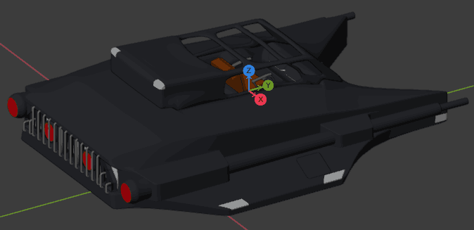

## Copyright infringement
**If your work has been unlawfully used in this project, please
[raise an issue](https://github.com/frostoven/Cosmosis/issues/new/choose)
and we'll remove it ASAP.** This project is maintained for free during
contributors' spare time, so it may take us a few days to notice the complaint.
However, rest assured copyright infringement is taken very seriously and your issue
_will_ be dealt with. Once the material has been removed, it may take a few
days to disappear from the latest stable release.

If the removal is highly disruptive, a financial backer may request
permission to buy it for continued use in this project and any derivatives.
Note that the agreement will require permission to modify the source work, and
your name will be in the credits. If you decline, or if seven days pass without
further communication from you, we'll proceed with removal anyway. Feel free to
specify that purchase is not an option in the issue raised to make things go
faster.

## Assets

### Mesh file formats
The rules on file formats are somewhat relaxed as some assets may be free
resources obtained online,  and aren't always easily modifiable. However, if
making assets yourself, the following structure is recommended and compatible
with stock Blender:
* Use GLTF format (orientation: Y is up).
* When loading meshes, the game treats Z as forward and Y as up. **Note:** for
  Blender that means designing your mesh such that Y is forward and Z is up 
  (and then exporting with Y as up). See Blender screenshot below.
* Do not embed media (i.e. include as separate files in same folder).
* Use DRACO compression.

Blender orientation example:



### Common issues
##### GLTF export crash
* Blender can sometimes crash if you try to use GLTF compression with messed up
geometry (such as orphaned vertices and lines). The solution here is to find
the bad geometry, fix it, and try again. Deleting objects one by one in a
backup file can help narrow down the issue. It also doesn't like certain
primitives, like bezier lines. Be sure to convert everything to mesh before
export.

##### Memory limits
Due to current Chromium restrictions, any file that would be greater than
around 1.8GB uncompressed (around 170MB compressed) cannot be uncompressed (the
loader aborts and logs an error). There are work-arounds, but these avoid the
core issue. 1.8GB is around 15 million verts, which runs at 40FPS on a 2080TI
(not to mention horrendous loading times). As a general rule of thumb, a scene
shouldn't exceed 1 million verts.

Where keeping under 1 million verts is possible:
* A small to medium sized spaceship. Subtle details can be replaced with
normal maps, bevels with more than 2 divisions can't be seen anyway, subsurf
modifiers should have geo cleaned up with tools like hardops, etc.

Where keeping under 1 million verts is *not* possible:
* A large map, perhaps with many detailed buildings. In this cased the solution
is to split the file into smaller ones and use LODs to remove verts that are
far away. Instead of distributing the map (or ginormous space station) as a
single file, you then instead distribute it as a directory. That way the entire
scene in all its glory can be loaded into the scene with, hopefully, less than
a million verts. Note that slightly going over 1m isn't a problem in and of
itself, but rather something we should work hard to avoid.

### Legal crap

##### Using assets with different licenses
Please do not use anything that is incompatible with this project's license. BSD is an example of a
compatible license.

_Some_ CC licenses are compatible. Look for licenses that:
* May be used commercially.
* Allows modification.
* Allows distribution.
* Allows private use.

GPL is incompatible and GPL licensed assets may not be used with this project.
If in doubt, do not use the asset at all (or consider raising an issue asking
for clarification).

##### Attribution
Include a license file with every asset (it should be in the same directory).
The license file's name should match the asset name. For example, a mesh named
`spaceship1.gltf` should be accompanied by a file named `spaceship1.license`.
If you have 10 spaceship meshes with the same name + a number and they share the
same license, you may name the license file something like `spaceship{1..10}.license`
or `spaceshipN.license` and then specify in the license file itself which files it
covers. In case numbers aren't used, the `_ALL` suffix may be used; the license file
then specifies the files covered. License files are not optional, and while
contributions truly are very much appreciated, we cannot accept additions that lack
license indications.

If you're making an asset specially for this project and don't want to worry
about legalities, feel free to simply put something like this in the license
file:
```text
This model is original work made for the Cosmosis project, and follows the
same license.

@author Your Name
[etc]
```
Ultimately, you may make the license and attribute your work any which way you
please so long as it's compatible with this project and comes with a license file as
described above.

## Art style

Please [raise an issue](https://github.com/frostoven/Cosmosis/issues/new/choose)
before starting work. This game's art style has a very specific direction. Even
if you create art much better than what's already in the project, it might
simply be rejected on the basis that it does not match existing style. Once
direction has been agreed upon, follow the [asset submission process](page does not exist yet)
to get your work into the production builds.

## Music style
Unlike with visual art, any music style goes because the user can pick and
choose what they want. 


## Voice packs
Anyone who can donate their voice probably should :). Submission details TBA.
[]

## Programming

<!-- TODO: Decide if we're open to advertising this way:

### We might pay for your IDE and other tools

_Note: we don't receive sponsorship from any of the companies listed below
(though we're open to it, if anyone at those companies see this document :p)._

#### Code
As thanks for writing us code, we may buy you a full year IntelliJ WebStorm
license (or a different package such as CLion for low level work [or both]) to
encourage further development, which we may renew the next year. IntelliJ IDEs
come with a 30-day evaluation which should give you enough time to write
something useful.

The requirement is that you write a bunch of code that's actually useful to the
project. 10,000 lines of code means nothing if it doesn't add real value. The
requirements are therefore subjective, so raise an issue asking about this if
in doubt. We'll reject phenomenally good code if we're about to discontinue the
mechanisms it's built on. We may buy you a license in good faith even if your
first code is rejected, if it has potential, but don't rely on that. We might
recall licenses purchased in good faith if awardees vanish off the internet.

Areas of interest:
* We're particularly interested in shader design. Note that your shaders need
  to support our engine. Shadertoy language, for example, won't work. Your
  shaders should also needs to have an option that looks reasonable on weaker
  cards. For example, if you've created the
  most beautiful procedural gas giant clouds ever beheld, but they only run on
  GeForce RTX 4090 cards, then you need to accompany your code with a
  low-graphics alternative that runs on slower hardware but doesn't offer a
  combat advantage when lowering graphics.
* Astronomical optimisation and visualisation.
* We're also interested people capable of modifying and maintaining
[NW.js](https://nwjs.io/), either in a way that can find its way to the main
NW.js repo, or in a way that allows future updates to easily integrate with
your changes.

#### Graphics design and modelling
Similar rules may be applied to other tools. For example, we may purchase
artists a substance painter subscription (or a Steam perpetual license if they
prefer), but the requirements on these are far stricter.

#### Can't you just hire me instead?
We can, but we're a small indie company, so our salaries aren't competitive at
the moment. If you're planning on contributing a lot and hoping for a side-job
to supplement your main job, we may be happy to work out something more formal. 

-->

### Development
* This project loosely follows
[Google's JavaScript Style Guide](https://google.github.io/styleguide/jsguide.html).
This means that we
[avoid relying on automatic semicolon insertion](https://google.github.io/styleguide/jsguide.html#formatting-semicolons-are-required).
While we're not strictly enforcing the standard yet, there's an
[open issue](https://github.com/frostoven/Cosmosis/issues/93)
to create the needed ESLint setup to do so.
* Please use [official Node.js sources](https://nodejs.org/en/download/) to
install Node 10 or higher, LTS. On Windows the installer should ask if you'd
like to install Chocolatey and Python - say yes unless you have your own custom
setup.
* Install git. On Windows, it will ask you how you'd like to handle CR/LF. You
want any option that converts to Unix LF when committing; at time of writing
the default option does exactly the right thing.
* Please consider testing your changes on both Windows and Linux. It isn't
a strict requirement, but makes PRs to master easier for those who test the
proposed changes because some small issues will already have been caught.

### Git branch workflow

```
yourBranch-dev  -\
                   >  dev  ->  master  ->  stable
someoneElse-dev -/
```

Whenever you do work, create yourself a branch. You may either name the
branch after yourself, or after an issue you're working on. If naming it after
yourself, call it`yourName-dev`. If naming it after an issue, name it `CSM-xx`
where `xx` is the issue number. You'll want to pull from `master` often as it
is where all code ends up before making its way to `stable`.

Once you believe your work is stable and you're ready to release it, create a
pull request from `yourName-dev` to `dev`. Please indicate if anything you've
done introduces breaking changes (please avoid breaking changes if possible).
If you do introduce breaking changes, please mention it in the PR. Having to
change previously passing unit tests to make things work with your new code can
be an indication of a breaking change.

Every now and again, a pull request is created from `dev` to `master`. When
this happens, the version number is incremented. How the number is incremented
depends on whether or not breaking changes were introduced, if there were bug
fixes, etc. The project owners then test if the `master` branch appears to be
stable.

If the current `master` branch is considered stable, it will be merged into
`stable`, at which point your changes will make it into the latest release.

### Is this project JavaScript or TypeScript?
Either / both. Don't let that scare you off. Consider the following:

This is JavaScript:
```js
// script.js
let x = 5;

function fn(y) {
  return 9 + y;
}
```

This is TypeScript:
```js
// script.ts
let x = 5;

function fn(y) {
  return 9 + y;
}
```

Nothing's changed because JS is perfectly valid TS. What TypeScript gives us is
the ability to *optionally* ask for typing assistance. For example, consider
this code:
```js
// This is both JavaScript and TypeScript
const spaceShip = loadGenericObject('my_spaceship.gltf');
```

Being generic, our IDE cannot tell us what methods or properties that spaceship
has. This means that in order to use the object, we need to go hunting down
source code, read it, learn it. If however we can figure out what
`loadGenericObject()` returns in this specific case, we can write the following
TypeScript that will allow the IDE to give us auto-completion, and do some
automatic error checking for us:
```typescript
// This is TypeScript only
const spaceShip: SpaceShip = loadGenericObject('my_spaceship.gltf');
```

Now we don't need to memorize any source. We can just use the object intuitively.
This project's configuration makes TS opt-in, not mandatory.

**You may write any new code as either JS or TS.** We do not discriminate. This
project is configured to allow importing JS into TS, and TS into JS, so your
choice won't impact code usability.

The only requirement we have is that you don't write TypeScript code in `.js`
files. Any file ending in `.js` may only contain JavaScript. If TypeScript will
be used, the file must end with `.ts`. Note that we may end up converting your
JS files into TS if it's more appropriate for us.

### Nomenclature
* plugin - modifies game functionality and rules. Cosmosis is largely based on
built-in plugins. Community game mods are also plugins.
* ship module - a game plugin that specifically focuses on being a swappable
physical ship part, sometimes with its own control mappings.
* node module - external application dependency.
* mesh code - data property, usually set within Blender, that is saved inside
the spaceship model file. Instructs the engine to treat that part of the mesh
specially. Switches and doors are examples of items that use mesh codes.

### Gotchas and problems

##### Three.js imports
Be careful when using the drei library. It has the incredibly annoying habit
of downloading sane defaults from the internet if you forget some function
parameters. This means that the game will work fine for days, just to then
crash and burn the moment your internet drops for a second. The crash will
happen for things as fundamental as mesh loading. When making changes involving
drei, please always test offline with cache disabled (Dev tools [Ctrl+Shift+I] -> Network -> Disable cache)
to ensure your changes aren't online-only.

### Setting up three.js auto-completion

A tutorial for VSCode is available here:
* http://shrekshao.github.io/2016/06/20/vscode-01/

Code dump:
```bash
We will use Typings to install these files.

Make sure you’ve installed node.js and run:

  npm install typings --global
Go to your project directory, run:

  typings init
There will be a typings.json file generated.

Now search for the three.js syntax file in DefinitelyTyped:

  typings search three
It will show all matched results. Find the one we need, the name is three

Install three

  typings install three --save --global
If this doesn’t work, try specify a domain for the typings, use this:
  typings install dt~three --save --global
Now with 1.x.x VSCode, we need to generate a jsconfig.json file in the root of the project folder by clicking the light bulb button at the bottom right.
```

For WebStorm, follow the above VSCode tutorial. By the time you reach the
VSCode-specific stuff, everything should already magically be working. If not:
* https://intellij-support.jetbrains.com/hc/en-us/community/posts/360000150644-Use-typescript-typings-for-javascript-code-completion

Code dump:
```bash
[...] Just add them to your project - this should normally be enough. Either
place them in your project folder, or add as Javascript libraries
(File | Settings | Languages & Frameworks | JavaScript | Libraries, Add...)
```
